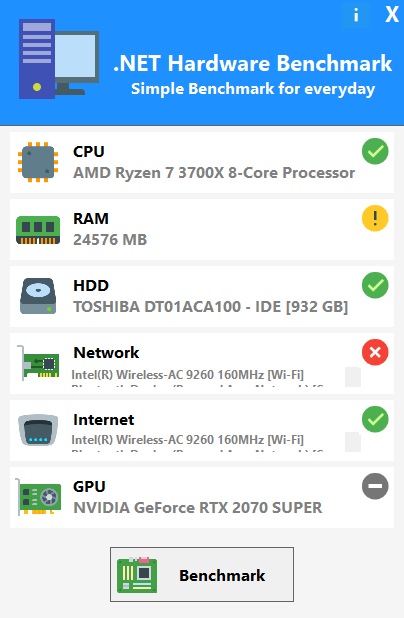

<h1 align=center><code>NetHardwareBench</code></h1>
<p align=center>
  
</p>

Benchmark your computer performance using .net/core

## Features

- Built-in modules with at least 8 base-module for benchmark, such as:
    -   CPU, RAM, GPU.Windows, Internet, LocalStorage, Network, RemoteStorage, Database ...
- Modular Architecture
- Easy to include new modules
- Works on Linux / Windows / MAC .... Calculator? Perhaps ..
- Made in .NET Core / Standard (why not)? =)
- Open source... Like? use without moderation hahaha

## Sample

- If you are running on windows, follow this path:
    - .\src\NetHardwareBench.App.Forms\NetHardwareBench.App.Forms.csproj (forms)
    - .\src\NetHardwareBench.App\NetHardwareBench.App.csproj (console)

- if you are in Linux / Mac / Raspberry / Calculator (maybe), look this sample:
    - .\src\NetHardwareBench.Core.App\NetHardwareBench.Core.App.csproj (console)

All output from sample apps where saved in the same application directory, using this template name 'benchmark_result_{?}.json'.

Lest see the sample data for each output.

- Summarized
```ini
[RAM]
|- AVG: 329,27 | Score: 75 %
[CPU]
|- AVG: 1,16 | Score: 100 %
[NETWORK]
|- AVG: 119,07 | Score: 0 %
[INTERNET]
|- AVG: 57,695 | Score: 100 %
 |- UPLOAD: 31,92 | Score: 100 %
 |- DOWNLOAD: 83,47 | Score: 100 %
[LOCAL_STORAGE]
|- AVG: 170,45 | Score: 100 %
 |- LOCAL STORAGE SPEED - WRITE [C:\]: 301,18 | Score: 100 %
 |- LOCAL STORAGE SPEED - READ [C:\]: 186,31 | Score: 100 %
 |- LOCAL STORAGE SPEED - WRITE [D:\]: 318,45 | Score: 100 %
 |- LOCAL STORAGE SPEED - READ [D:\]: 156,12 | Score: 100 %
 |- LOCAL STORAGE SPEED - WRITE [E:\]: 243,65 | Score: 100 %
 |- LOCAL STORAGE SPEED - READ [E:\]: 149,51 | Score: 100 %
 |- LOCAL STORAGE SPEED - WRITE [G:\]: 5,75 | Score: 50 %
 |- LOCAL STORAGE SPEED - READ [G:\]: 2,62 | Score: 25 %

```
- Detailed

```json
[
  {
    "PartialResults": [
      {
        "Description": "MEMORY - WRITE_SPEED",
        "ResultType": 1,
        "Score": 329.27,
        "MetricScale": 2
      }
    ],
    "BenchmarkType": 4,
    "StartedAt": "2022-02-12T18:37:40.4005735-03:00",
    "FinishedAt": "2022-02-12T18:37:44.0394068-03:00",
    "TimeSpend": "00:00:03.6388333",
    "Score": 329.27,
    "StepsDetails": [
      "Starting RAM Benchmark",
      "Finished RAM Benchmark"
    ]
  },
  {
    "PartialResults": [
      {
        "Description": "CPU - MulBigDouble",
        "ResultType": 6,
        "Score": 0.49883459999999996,
        "MetricScale": 6
      },
      {
        "Description": "CPU - MulBigInt",
        "ResultType": 6,
        "Score": 0.6131962,
        "MetricScale": 6
      },
      {
        "Description": "CPU - DivBigDouble",
        "ResultType": 6,
        "Score": 0.5093685,
        "MetricScale": 6
      },
      {
        "Description": "CPU - DivBigInt",
        "ResultType": 6,
        "Score": 0.7443913,
        "MetricScale": 6
      },
      {
        "Description": "CPU - MulSmallDouble",
        "ResultType": 6,
        "Score": 0.61091659999999992,
        "MetricScale": 6
      },
      {
        "Description": "CPU - MulSmallInt",
        "ResultType": 6,
        "Score": 0.7542852,
        "MetricScale": 6
      },
      {
        "Description": "CPU - DivSmallDouble",
        "ResultType": 6,
        "Score": 0.63349349999999993,
        "MetricScale": 6
      },
      {
        "Description": "CPU - DivSmallInt",
        "ResultType": 6,
        "Score": 1.0048314,
        "MetricScale": 6
      },
      {
        "Description": "CPU - AddBigDouble",
        "ResultType": 6,
        "Score": 0.4989459,
        "MetricScale": 6
      },
      {
        "Description": "CPU - AddBigInt",
        "ResultType": 6,
        "Score": 0.5471838,
        "MetricScale": 6
      },
      {
        "Description": "CPU - SubBigDouble",
        "ResultType": 6,
        "Score": 0.49978259999999997,
        "MetricScale": 6
      },
      {
        "Description": "CPU - SubBigInt",
        "ResultType": 6,
        "Score": 0.5483428,
        "MetricScale": 6
      },
      {
        "Description": "CPU - AddSmallDouble",
        "ResultType": 6,
        "Score": 0.6149868,
        "MetricScale": 6
      },
      {
        "Description": "CPU - AddSmallInt",
        "ResultType": 6,
        "Score": 0.6749533,
        "MetricScale": 6
      },
      {
        "Description": "CPU - SubSmallDouble",
        "ResultType": 6,
        "Score": 0.6220004,
        "MetricScale": 6
      },
      {
        "Description": "CPU - SubSmallInt",
        "ResultType": 6,
        "Score": 0.6724527,
        "MetricScale": 6
      },
      {
        "Description": "CPU - CALCULATE PRIME_NUMBER [1]",
        "ResultType": 6,
        "Score": 2.8683463,
        "MetricScale": 6
      },
      {
        "Description": "CPU - CALCULATE PRIME_NUMBER [2]",
        "ResultType": 6,
        "Score": 2.8636923999999997,
        "MetricScale": 6
      },
      {
        "Description": "CPU - CALCULATE PRIME_NUMBER [3]",
        "ResultType": 6,
        "Score": 2.8824551,
        "MetricScale": 6
      },
      {
        "Description": "CPU - CALCULATE PRIME_NUMBER [4]",
        "ResultType": 6,
        "Score": 2.8656802,
        "MetricScale": 6
      },
      {
        "Description": "CPU - CALCULATE PRIME_NUMBER [5]",
        "ResultType": 6,
        "Score": 2.8686932,
        "MetricScale": 6
      }
    ],
    "BenchmarkType": 0,
    "StartedAt": "2022-02-12T18:37:44.0419066-03:00",
    "FinishedAt": "2022-02-12T18:38:08.4459068-03:00",
    "TimeSpend": "00:00:24.4040002",
    "Score": 1.16,
    "StepsDetails": [
      "Starting CPU Benchmark",
      "Finished CPU Benchmark"
    ]
  },
  {
    "PartialResults": [
      {
        "Description": "NETWORK - DELAY [0]",
        "ResultType": 4,
        "Score": 123.0,
        "MetricScale": 5
      },
      {
        "Description": "NETWORK - DELAY [1]",
        "ResultType": 4,
        "Score": 120.0,
        "MetricScale": 5
      },
      {
        "Description": "NETWORK - DELAY [2]",
        "ResultType": 4,
        "Score": 126.0,
        "MetricScale": 5
      },
      {
        "Description": "NETWORK - DELAY [3]",
        "ResultType": 4,
        "Score": 118.0,
        "MetricScale": 5
      },
      {
        "Description": "NETWORK - DELAY [4]",
        "ResultType": 4,
        "Score": 116.0,
        "MetricScale": 5
      },
      {
        "Description": "NETWORK - DELAY [5]",
        "ResultType": 4,
        "Score": 117.0,
        "MetricScale": 5
      },
      {
        "Description": "NETWORK - DELAY [6]",
        "ResultType": 4,
        "Score": 119.0,
        "MetricScale": 5
      },
      {
        "Description": "NETWORK - DELAY [7]",
        "ResultType": 4,
        "Score": 118.0,
        "MetricScale": 5
      },
      {
        "Description": "NETWORK - DELAY [8]",
        "ResultType": 4,
        "Score": 118.0,
        "MetricScale": 5
      },
      {
        "Description": "NETWORK - DELAY [9]",
        "ResultType": 4,
        "Score": 116.0,
        "MetricScale": 5
      },
      {
        "Description": "NETWORK - DELAY [10]",
        "ResultType": 4,
        "Score": 118.0,
        "MetricScale": 5
      },
      {
        "Description": "NETWORK - DELAY [11]",
        "ResultType": 4,
        "Score": 119.0,
        "MetricScale": 5
      },
      {
        "Description": "NETWORK - DELAY [12]",
        "ResultType": 4,
        "Score": 118.0,
        "MetricScale": 5
      },
      {
        "Description": "NETWORK - DELAY [13]",
        "ResultType": 4,
        "Score": 118.0,
        "MetricScale": 5
      },
      {
        "Description": "NETWORK - DELAY [14]",
        "ResultType": 4,
        "Score": 122.0,
        "MetricScale": 5
      }
    ],
    "BenchmarkType": 3,
    "StartedAt": "2022-02-12T18:38:08.4484068-03:00",
    "FinishedAt": "2022-02-12T18:38:11.9116669-03:00",
    "TimeSpend": "00:00:03.4632601",
    "Score": 119.07,
    "StepsDetails": [
      "Starting Network Benchmark",
      "Finished Network Benchmark"
    ]
  },
  {
    "PartialResults": [
      {
        "Description": "UPLOAD",
        "ResultType": 2,
        "Score": 31.92,
        "MetricScale": 2
      },
      {
        "Description": "DOWNLOAD",
        "ResultType": 3,
        "Score": 83.47,
        "MetricScale": 2
      }
    ],
    "BenchmarkType": 2,
    "StartedAt": "2022-02-12T18:38:11.9136692-03:00",
    "FinishedAt": "2022-02-12T18:38:19.141536-03:00",
    "TimeSpend": "00:00:07.2278668",
    "Score": 57.695,
    "StepsDetails": [
      "Starting Internet Benchmark",
      "Finished Internet Benchmark"
    ]
  },
  {
    "PartialResults": [
      {
        "Description": "LOCAL STORAGE SPEED - WRITE [C:\\]",
        "ResultType": 2,
        "Score": 301.18,
        "MetricScale": 2
      },
      {
        "Description": "LOCAL STORAGE SPEED - READ [C:\\]",
        "ResultType": 2,
        "Score": 186.31,
        "MetricScale": 2
      },
      {
        "Description": "LOCAL STORAGE SPEED - WRITE [D:\\]",
        "ResultType": 2,
        "Score": 318.45,
        "MetricScale": 2
      },
      {
        "Description": "LOCAL STORAGE SPEED - READ [D:\\]",
        "ResultType": 2,
        "Score": 156.12,
        "MetricScale": 2
      },
      {
        "Description": "LOCAL STORAGE SPEED - WRITE [E:\\]",
        "ResultType": 2,
        "Score": 243.65,
        "MetricScale": 2
      },
      {
        "Description": "LOCAL STORAGE SPEED - READ [E:\\]",
        "ResultType": 2,
        "Score": 149.51,
        "MetricScale": 2
      },
      {
        "Description": "LOCAL STORAGE SPEED - WRITE [G:\\]",
        "ResultType": 2,
        "Score": 5.75,
        "MetricScale": 2
      },
      {
        "Description": "LOCAL STORAGE SPEED - READ [G:\\]",
        "ResultType": 2,
        "Score": 2.62,
        "MetricScale": 2
      }
    ],
    "BenchmarkType": 5,
    "StartedAt": "2022-02-12T18:38:19.144037-03:00",
    "FinishedAt": "2022-02-12T18:40:02.6027893-03:00",
    "TimeSpend": "00:01:43.4587523",
    "Score": 170.45,
    "StepsDetails": [
      "Starting Local Storage Benchmark",
      "Finished Local Storage Benchmark"
    ]
  }
]
```

You just need to inform the path to scan.

## Credits

Creator:

- [ME](https://github.com/rodrigoramosrs)

inspiration:

- some other opensource projects built with .net core
